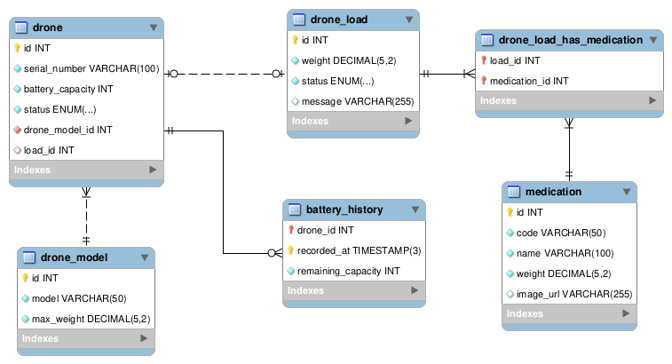

# Fleet Database SQL Script

The `create_schema.sql` script defines the database schema for a fleet management system, including drones, loads, medications, battery history, and their relationships. The script was generated using MySQL Workbench from this database diagram.



## Purpose

The purpose of this script is to provide the necessary database structure for a fleet management system that involves drones capable of carrying medications. The database design encompasses various entities such as drones, loads, medications, and battery history, allowing for efficient tracking and management of the fleet.

## Database Schema Overview

The database schema includes the following tables:

- **Load**: Represents a load of medications with information such as weight, status, and associated drone.
- **Drone**: Describes the characteristics of drones, including serial number, battery capacity, and status.
- **Medication**: Contains information about medications, including name, code, weight, and an optional image URL.
- **Battery_History**: Records historical battery data for drones, including recorded timestamp and remaining capacity.
- **Load_has_Medication**: Facilitates a many-to-many relationship between loads and medications, allowing for efficient management of loaded medications.
- **Drone_Model**: A lookup table that contains drone models and their corresponding weight limits.


## Setting Up the Database

Before building and running the application, you need to set up the database. Follow these steps:

1. Open a terminal and navigate to the `database` directory in the project root.

2. Log in to your MySQL server with administrative privileges:
    
    ```bash
    mysql -u root -p
    ```
    You will be prompted to enter the password for the `root` user.

3. Run the `create_user.sql` script to create a new database user:

    ```bash
    source create_user.sql
    ```

4. Run the `create_schema.sql` script to create the database schema:

    ```bash
    source create_schema.sql
    ```

5. Run the `insert_data.sql` script to insert initial data into the database:

    ```bash
    source insert_data.sql
    ```

6. Exit the MySQL shell:

    ```bash
    exit
    ```

After setting up the database, you can proceed with building and running the application.


